# Psychohistory Timeline Diagram

A vertical overview of selected events across the Robot, Empire, and Foundation eras, with horizontally grouped event notes and R. Daneel Olivaw appearances. Dates follow the C.E. chronology in the [Psychohistory Timeline](./psychohistory-timeline.md). Speculative dates and inferred appearances are marked explicitly.

**Legend:** Gold = key event; green = Hari Seldon appearance; blue = Daneel appearance or identity; dashed outline = inferred or speculative.

```mermaid
flowchart TB
  classDef event fill:#f5ecd8,stroke:#8a6d3b,color:#302819
  classDef hari fill:#e7efe2,stroke:#62734f,color:#273020
  classDef daneel fill:#e2eff2,stroke:#356873,color:#1f3438
  classDef inferred fill:#f0eeee,stroke:#777777,color:#333333,stroke-dasharray:5 5

  subgraph r1949["<div style='text-align:center;padding-bottom:12px'>1949 C.E.</div>"]
    direction LR
    e1949["Joseph Schwartz disappears"]:::event
  end
  subgraph r1982["<div style='text-align:center;padding-bottom:12px'>1982 C.E.</div>"]
    direction LR
    e1982["Susan Calvin is born; U.S. Robots is founded"]:::event
  end
  subgraph r2005["<div style='text-align:center;padding-bottom:12px'>2005–2008 C.E.</div>"]
    direction LR
    e2005["Andrew Martin is activated; Calvin joins U.S. Robots; Herbie is active and destroyed"]:::event
  end
  subgraph r2064["<div style='text-align:center;padding-bottom:12px'>2064 C.E.</div>"]
    direction LR
    e2064["Susan Calvin dies; colonization begins"]:::event
  end
  subgraph r2082["<div style='text-align:center;padding-bottom:12px'>2082–2102 C.E. (speculative)</div>"]
    direction LR
    e2082["Stephen Byerly's political career and World Coordinator service"]:::inferred
  end
  subgraph r2205["<div style='text-align:center;padding-bottom:12px'>2205 C.E.</div>"]
    direction LR
    e2205["Andrew Martin is declared human and dies"]:::event
  end
  subgraph r3200["<div style='text-align:center;padding-bottom:12px'>3200 C.E.</div>"]
    direction LR
    e3200["Solaria is settled"]:::event
    d3200["R. Daneel Olivaw is created"]:::daneel
  end
  subgraph r3459["<div style='text-align:center;padding-bottom:12px'>3459 C.E. (inferred)</div>"]
    direction LR
    e3459["Elijah Baley is born"]:::inferred
  end
  subgraph r3500["<div style='text-align:center;padding-bottom:12px'>3500 C.E.</div>"]
    direction LR
    e3500["The Caves of Steel: Daneel and Baley solve a crime"]:::daneel
  end
  subgraph r3501["<div style='text-align:center;padding-bottom:12px'>3501 C.E.</div>"]
    direction LR
    e3501["The Naked Sun: Daneel and Baley investigate on Solaria"]:::daneel
  end
  subgraph r3503["<div style='text-align:center;padding-bottom:12px'>3503 C.E.</div>"]
    direction LR
    e3503["The Robots of Dawn: Daneel, Baley, and Giskard are on Aurora"]:::daneel
    e3503b["Han Fastolfe first uses the term psychohistory"]:::event
  end
  subgraph r3537["<div style='text-align:center;padding-bottom:12px'>3537 C.E.</div>"]
    direction LR
    e3537["Baley dies; the long-term psychohistory mission develops"]:::event
    d3537["Daneel remains active across the Spacer and Empire eras"]:::daneel
  end
  subgraph r3695["<div style='text-align:center;padding-bottom:12px'>3695–3700 C.E.</div>"]
    direction LR
    e3695["Fastolfe dies; Giskard considers the Zeroth Law; Mandamus plants nuclear amplifiers; Earth is made radioactive and the Diaspora begins"]:::event
  end
  subgraph r3800["<div style='text-align:center;padding-bottom:12px'>c. 3800 C.E. (speculative)</div>"]
    direction LR
    e3800["Caliban Trilogy: the New Law crisis on Inferno"]:::inferred
  end
  subgraph r11300["<div style='text-align:center;padding-bottom:12px'>11300 C.E.</div>"]
    direction LR
    e11300["Rhodia and the Nebular Kingdoms are free"]:::event
  end
  subgraph r12000["<div style='text-align:center;padding-bottom:12px'>12000 C.E.</div>"]
    direction LR
    e12000["Trantorian Republic becomes the Empire"]:::event
  end
  subgraph r12300["<div style='text-align:center;padding-bottom:12px'>12300 C.E.</div>"]
    direction LR
    e12300["Biron Farrill's era; half the Galaxy is in the Empire"]:::event
  end
  subgraph r12500["<div style='text-align:center;padding-bottom:12px'>12500 C.E.</div>"]
    direction LR
    e12500["Galactic Empire founded; Galactic Era calendar begins"]:::event
  end
  subgraph r24488["<div style='text-align:center;padding-bottom:12px'>11988–12020 G.E.<br/>24488–24520 C.E.</div>"]
    direction LR
    e24488["Hari Seldon and Cleon I are born"]:::event
    d24488["Daneel serves as Eto Demerzel, advisor to Cleon I"]:::daneel
  end
  subgraph r24515["<div style='text-align:center;padding-bottom:12px'>12015 G.E.<br/>24515 C.E.</div>"]
    direction LR
    h24515["Hari Seldon's political conflict with Jo-Jo Joranum"]:::hari
  end
  subgraph r24520["<div style='text-align:center;padding-bottom:12px'>12020–12070 G.E.<br/>24520–24570 C.E.</div>"]
    direction LR
    e24520["Seldon advances psychohistory; later exiled from Trantor"]:::event
    h24520["Hari's in-person prequel appearances; key encounters include Cleon I, Demerzel, Hummin, Dors, Yugo, Raych, Wanda"]:::hari
    h24525["24525 C.E.: Hari learns Dors's nature and mission"]:::hari
    d24520["Daneel continues as Demerzel and guides Seldon"]:::daneel
  end
  subgraph r24567["<div style='text-align:center;padding-bottom:12px'>12067 G.E. / 1 F.E.<br/>24567 C.E.</div>"]
    direction LR
    e24567["Seldon is exiled; the Foundation Era calendar begins"]:::event
    h24567["Hari at trial with Gaal Dornick before Linge Chen"]:::hari
  end
  subgraph r24570["<div style='text-align:center;padding-bottom:12px'>3 F.E.<br/>24570 C.E.</div>"]
    direction LR
    e24570["Hari Seldon dies"]:::event
  end
  subgraph r24600["<div style='text-align:center;padding-bottom:12px'>36 F.E.<br/>24600 C.E. (authorized sequel chronology)</div>"]
    direction LR
    e24600["Daneel and Lodovik Trema shape the Foundation's future"]:::daneel
  end
  subgraph r24617["<div style='text-align:center;padding-bottom:12px'>50 F.E.<br/>24617 C.E.</div>"]
    direction LR
    h24617["Recorded Hari Seldon hologram appears before Salvor Hardin, Lewis Pirenne, and the Foundation Board"]:::hari
  end
  subgraph r24647["<div style='text-align:center;padding-bottom:12px'>80 F.E.<br/>24647 C.E.</div>"]
    direction LR
    h24647["After the second crisis, Hari warns Hardin and Foundation leadership that Scientism cannot sustain expansion"]:::hari
  end
  subgraph r24727["<div style='text-align:center;padding-bottom:12px'>160 F.E.<br/>24727 C.E.</div>"]
    direction LR
    h24727["After victory over Korell, a Vault message confirms the trade-based transition; audience not named"]:::hari
  end
  subgraph r24762["<div style='text-align:center;padding-bottom:12px'>195 F.E.<br/>24762 C.E.</div>"]
    direction LR
    e24762["Bel Riose campaign"]:::event
    d24762["Possible Daneel influence during 24762–24877 C.E.; inferred, not a confirmed appearance"]:::inferred
  end
  subgraph r24827["<div style='text-align:center;padding-bottom:12px'>260 F.E.<br/>24827 C.E.</div>"]
    direction LR
    e24827["Gilmer sacks Trantor; a peace treaty follows"]:::event
  end
  subgraph r24867["<div style='text-align:center;padding-bottom:12px'>300 F.E.<br/>24867 C.E.</div>"]
    direction LR
    e24867["The Mule conquers the Foundation"]:::event
    h24867["Scheduled Seldon hologram predicts a Traders' revolt, not the Mule; message cuts off when Terminus loses power"]:::hari
  end
  subgraph r24872["<div style='text-align:center;padding-bottom:12px'>305 F.E.<br/>24872 C.E.</div>"]
    direction LR
    e24872["The Mule's mind is altered; his conquest ends"]:::event
  end
  subgraph r24877["<div style='text-align:center;padding-bottom:12px'>310 F.E.<br/>24877 C.E.</div>"]
    direction LR
    e24877["The Mule dies"]:::event
  end
  subgraph r24943["<div style='text-align:center;padding-bottom:12px'>376–498 F.E.<br/>24943–25065 C.E.</div>"]
    direction LR
    e24943["Second Foundation search; Trevize encounters Daneel as D.G. Golan"]:::daneel
  end
  subgraph r25065["<div style='text-align:center;padding-bottom:12px'>498 F.E.<br/>25065 C.E.</div>"]
    direction LR
    h25065["Quincentennial-era hologram appears before Mayor Harla Branno and the Foundation Council"]:::hari
    e25065["Trevize chooses Galaxia"]:::event
  end
  subgraph r25066["<div style='text-align:center;padding-bottom:12px'>499 F.E.<br/>25066 C.E.</div>"]
    direction LR
    e25066["Trevize locates Earth and meets Daneel; Daneel merges with the robots"]:::daneel
  end

  r1949 --> r1982 --> r2005 --> r2064 --> r2082 --> r2205 --> r3200 --> r3459 --> r3500 --> r3501 --> r3503 --> r3537 --> r3695 --> r3800 --> r11300 --> r12000 --> r12300 --> r12500 --> r24488 --> r24515 --> r24520 --> r24567 --> r24570 --> r24600 --> r24617 --> r24647 --> r24727 --> r24762 --> r24827 --> r24867 --> r24872 --> r24877 --> r24943 --> r25065 --> r25066
```

## Cross-References

- For the detailed event list, see [Psychohistory Timeline](./psychohistory-timeline.md).
- For Daneel's identities and date ranges, see [Daneel's Identities and Locations](./daneel-identities.md).
- For the major character roster, see [Key Characters](./key-characters.md).
- For character relationships, see [Character Relationships](./character-relationships.md).
- For fictional chronology and publication order, see [Asimov Timeline](./asimov-timeline.md).
- For worlds and settlements, see [World Settlement & Locations](./world-settlement-locations.md).
